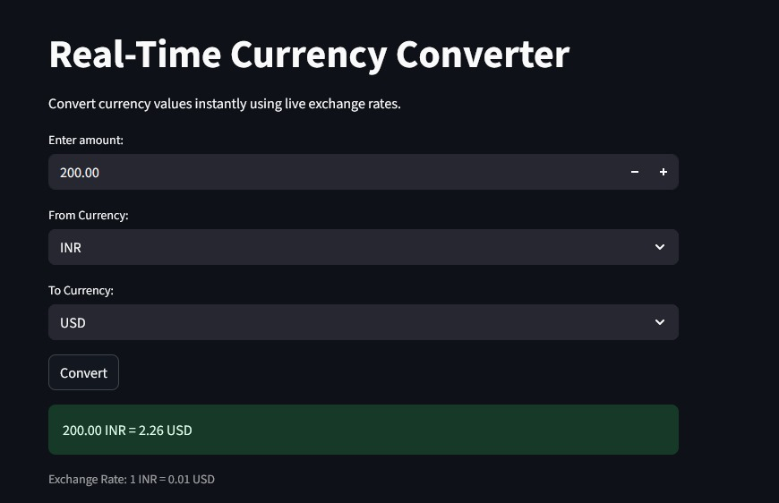

# 💱 Currency Converter App

A real-time currency converter web application built with Streamlit that fetches live exchange rates.


## streamlit link
 **Live Demo:** [Click here to view](https://money-converter.streamlit.app/)


## screenshot



## Features

-  **Live Exchange Rates** - Fetches real-time exchange rates using the ExchangeRate API
-  **Multiple Currencies** - Support for USD, INR, EUR, GBP, JPY, AUD, and CAD
-  **Simple Interface** - Clean and intuitive Streamlit UI
-  **Instant Conversion** - Convert currency values with a single click

## Requirements

- Python 3.7+
- Streamlit
- Requests

## Installation

1. Clone the repository:
```bash
git clone <your-repo-url>
cd currency_converter_App
```

2. Install dependencies:
```bash
pip install streamlit requests
```

## Usage

Run the application with:
```bash
streamlit run currency_converter.py
```

The app will open in your browser at `http://localhost:8501`

## How to Use

1. Enter the amount you want to convert
2. Select the source currency (From Currency)
3. Select the target currency (To Currency)
4. Click the **Convert 💸** button
5. View the converted amount and current exchange rate

## API

This app uses the [ExchangeRate API](https://www.exchangerate-api.com/) for fetching live exchange rates.

## License

MIT License

## Author

Built with  using Streamlit and ExchangeRate API# currency_converter_App